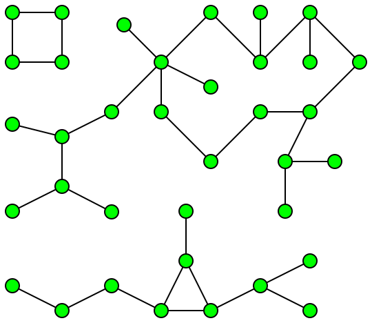
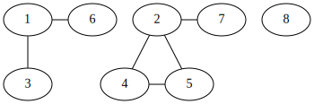

[](https://classroom.github.com/online_ide?assignment_repo_id=4717029&assignment_repo_type=AssignmentRepo)
# Гүний хайлт 
 

Чиглэлгүй граф өгөгдөхөд граф доторх холбоост бүрдлүүдийн тоог болон хамгийн том холбоос бүрдлийн хэмжээг ол. Жишээ нь



зурагт 3 холбоост бүрдэл байх ба хамгийн том бүрдлийн хэмжээ нь 22 байна.

Таны програм `n <= 10,000` граф дээр **1 секунтад** ажиллах ёстой.

## Оролт

Графын өгөгдлийг оруулахдаа эхлээд дараах 2 өгөгдлийг оруулна. Оройн тоо `n`, ирмэгийн тоо `m` гэсэн 2 утгыг дарааллаар нь оруулна. 
Дараагаар нь ирмэгүүдийн тоогоор, ирмэгийг дүрслэх `x`, `y` утгыг оруулна. Энэ нь `x`, `y` хоёр оройн хооронд ирмэг байгааг дүрсэлнэ. Оройн дугаар 1-с эхэлнэ. Жишээ нь
```
8 6 
1 6
1 3
2 7
2 5
2 4
4 5
```
гэж оруулахад доорх зурагт харуулсан граф үүснэ.


## Гаралт

Гаралтад хамгийн эхний мөрөнд графт хэдэн бүрдэл хэсэг байгаа тоог хэвлэнэ.
Дараагаар нь бүрдэл хэсэг тус бүрд хэдэн орой байгааг, нэг хоосон зайгаар тусгаарлан нэг мөрөнд буурах дарааллаар хэвлэнэ. Бидний жишээний хувьд 
```
3
4 3 1
```
гэж хэвлэнэ.

## Хэрэгжүүлэх заавар

Энэ даалгаварт дараах үйлдлийг хийнэ.
  1. Графын өгөгдлийн гараас авч, `Graph` бүтцийн объектыг баяжуулна.
  2. `gr_connected_components` функцийг дуудаж холбоост бүрдлийн мэдээллийг байгуулна.  
  3. `single_pivot_qsort` функцийг дуудаж холбоост бүрдлийн мэдээллийг буурахаар эрэмбэлнэ.
  4. Эрэмбэлсэн холбоост бүрдлийн мэдээллийг хэвлэнэ.

### Графыг хадгалах

Графыг хадгалахдаа хөрш матрицын зарчмыг ашиглан хадгална. Графын мэдээллийг `Graph` бүтцэд хадгална.

```C
struct Graph {
	int n;     // Оройн тоо
	int m;     // Ирмэгүүдийн тоо
	List *adj;
};
typedef struct Graph Graph;
```
Граф бүтцийг ашиглахаас өмнө `init_graph()` функцийг дуудаж графыг эхлүүлнэ. Жишээ нь `n` оройтой графыг

```C
Graph G;
init_graph(&G, n);
```
дуудан үүсгэнэ.

Хөрш оройнуудыг `adj` жагсаалтан хүснэгтэд хадгална. Ингэснээр `G.adj[u]` жагсаалтад `u` оройтой хөрш бүх оройг хийнэ. Жишээ нь `2`, `4` оройнууд хөрш бол
`
l_push_back(&G.adj[2], 4);
`
гэж `G.adj[2]` жагсаалтын төгсгөлд `4` утгыг оруулж өгнө. 

Жагсаалтын хувьд 8-р даалгавар дээр хэрэгжүүлсэн жагсаалтын кодыг тэр чигээр нь авчран ашиглаж болно.
```C
void l_push_back(List *, int);
void l_push_front(List *, int);
void l_insert(List *, int, int);
void l_pop_front(List *);
void l_pop_back(List *);
void l_erase(List *, int);
void l_print(List *);
Elm *l_search(List *, int);
```

`u` оройны бүх хөрш оройнуудаар давтахдаа дараах байдлаар давталтыг ашиглана.

```C
Elm *i;
for (i = G.adj[u].head; i != NULL; i = i->next) {
	// Энд i->x нь u оройны хөрш юм.
	// ...
}
```

### Аль хэдийн хэрэгжүүлсэн функцүүд

 * Графыг эхлүүлэх функц: `g` графын хөршүүдийг хадгалах жагсаалтан хүснэгтийг эхлүүлэх функц. Санах ойг бэлдэж, жагсаалтын `head`, `tail` утгуудад `NULL` онооно.
   ```C
   void gr_init_graph(Graph *g, int n)
   {
	   int i;
	   g->adj = (List *) malloc(sizeof(List) * (n + 1));
	   g->n = n;
	   for (i = 0; i <= n; i++) {
		   g->adj[i].head = g->adj[i].tail = NULL;
		   g->adj[i].len = 0;
	   }
   }
   ```
 
### Хэрэгжүүлэх функцүүд

 * Ирмэг нэмэх функц: `g` графын ирмэгүүдийг хадгалах `adj` жагсаалтан хүснэгтэд ирмэг нэмнэ. Уг граф нь чиглэлгүй граф тул `x`-с `y`, `y`-с `x` гэсэн хоёр ирмэгийг оруулна.
   ```C
   void gr_add_edge(Graph *g, int x, int y);
   ```

 * Холбоост бүрдлүүдийг олох функц: `g` граф дээр гүний нэвтрэлт хийн холбоост бүрдлүүдийг олж `cc` хүснэгтийг дүүрнэ.
   ```C
   void gr_connected_components(Graph *g, int *cc);
   ```
   `cc`: Хүснэгтийн `0` дахь индекс дээр хүснэгтэд оруулсан элементийн тоо буюу нийт хэдэн бүрдэл хэсэг байгаа талаарх мэдээлэл хадгалагдана. Харин хүснэгт бусад элементүүд бүрдэл хэсэг тус бүрийн оройн тоог хадгална. Уг хүснэгтийн `0` индексээс бусад элементүүдийн нийлбэр `n` гарах ёстой.
   
   Жишээ нь бидний жишээний хувьд уг хүснэгт
   
   |    | 0 | 1 | 2 | 3 |
   |:--:|:-:|:-:|:-:|:-:|
   | cc | 3 | 3 | 4 | 1 |

   гэсэн утгуудыг хадгалж болно. Графт 3 ширхэг холбоост бүрдэл байгаа тул `cc[0] = 3` байна. 

   Холбоост бүрдлүүдийг олохдоо гүний нэвтрэлт ашиглана. Очоогүй орой бүр дээр гүний нэвтрэлтийг дуудах ба нэг гүний нэвтрэлтээр очсон бүх орой тухайн бүрдэл хэсэгт харьяалагдана. 
