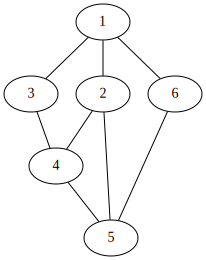

[](https://classroom.github.com/online_ide?assignment_repo_id=4717034&assignment_repo_type=AssignmentRepo)
# Төвшний хайлт 
 

Граф дээр `s`, `t` хоёр орой өгөгдөхөд хоорондох хамгийн богино замыг ол. 

Таны програм `n <= 10,000` граф дээр **1 секунтад** ажиллах ёстой.

## Оролт

Графын өгөгдлийг оруулахдаа эхлээд дараах 4 өгөгдлийг оруулна. Оройн тоо `n`, ирмэгийн тоо `m`, `s`, `t` гэсэн 4 утгыг дарааллаар нь оруулна. 
Дараагаар нь ирмэгүүдийн тоогоор, ирмэгийг дүрслэх `x`, `y` утгыг оруулна. Энэ нь `x`, `y` хоёр оройн хооронд ирмэг байгааг дүрсэлнэ. Оройн дугаар 1-с эхэлнэ. Жишээ нь
```
6 8 1 5
1 2
3 1
3 4
2 4
5 4
6 5
1 6
2 5
```
гэж оруулахад доорх зурагт харуулсан граф үүснэ.


## Гаралт

`s`, `t` оройнуудын хооронд зам байгаа бол хамгийн богино замын уртыг хэвлэнэ. Дараагийн мөрөнд замын оройнуудыг, `s`-ээс `t` хүртэл зочлох дарааллаар хоосон зайгаар тусгаарлан хэвлэнэ.

## Хэрэгжүүлэх заавар

### Графыг хадгалах

Графыг хадгалахдаа хөрш матрицын зарчмыг ашиглан хадгална. Графын мэдээллийг `Graph` бүтцэд хадгална.

```C
struct Graph {
	int n;     // Оройн тоо
	int m;     // Ирмэгүүдийн тоо
	List *adj;
};
typedef struct Graph Graph;
```
Граф бүтцийг ашиглахаас өмнө `init_graph()` функцийг дуудаж графыг эхлүүлнэ. Жишээ нь `n` оройтой графыг

```C
Graph G;
init_graph(&G, n);
```
дуудан үүсгэнэ.

Хөрш оройнуудыг `adj` жагсаалтан хүснэгтэд хадгална. Ингэснээр `G.adj[u]` жагсаалтад `u` оройтой хөрш бүх оройг хийнэ. Жишээ нь `2`, `4` оройнууд хөрш бол
`
l_push_back(&G.adj[2], 4);
`
гэж `G.adj[2]` жагсаалтын төгсгөлд `4` утгыг оруулж өгнө. 

Жагсаалтын хувьд 8-р даалгавар дээр хэрэгжүүлсэн жагсаалтын кодыг тэр чигээр нь авчран ашиглаж болно.
```C
void l_push_back(List *, int);
void l_push_front(List *, int);
void l_insert(List *, int, int);
void l_pop_front(List *);
void l_pop_back(List *);
void l_erase(List *, int);
void l_print(List *);
Elm *l_search(List *, int);
```

`u` оройны бүх хөрш оройнуудаар давтахдаа дараах байдлаар давталтыг ашиглана.

```C
Elm *i;
for (i = G.adj[u].head; i != NULL; i = i->next) {
	// Энд i->x нь u оройны хөрш юм.
	// ...
}
```

### Аль хэдийн хэрэгжүүлсэн функцүүд

 * Графыг эхлүүлэх функц: `g` графын хөршүүдийг хадгалах жагсаалтан хүснэгтийг эхлүүлэх функц. Санах ойг бэлдэж, жагсаалтын `head`, `tail` утгуудад `NULL` онооно.
   ```C
   void gr_init_graph(Graph *g, int n)
   {
	   int i;
	   g->adj = (List *) malloc(sizeof(List) * (n + 1));
	   g->n = n;
	   for (i = 0; i <= n; i++) {
		   g->adj[i].head = g->adj[i].tail = NULL;
		   g->adj[i].len = 0;
	   }
   }
   ```
 
### Хэрэгжүүлэх функцүүд

 * Ирмэг нэмэх функц: `g` графын ирмэгүүдийг хадгалах `adj` жагсаалтан хүснэгтэд ирмэг нэмнэ. Уг граф нь чиглэлгүй граф тул `x`-с `y`, `y`-с `x` гэсэн хоёр ирмэгийг оруулна.
   ```C
   void gr_add_edge(Graph *g, int x, int y);
   ```

 * Төвшний нэвтрэлтийн функц: `g` граф дээр `s` оройгоос эхлэн төвшний нэвтрэлтийг хийнэ.
   ```C
   void gr_bfs(Graph *g, int s, int pi[]);
   ```
   `pi`: Төвшний нэвтрэлт хийсний дараа `pi[u]` нь `u` оройд ямар оройгоос ирснийг хадгална. Тухайн орой дээр `s` оройгоос ирэх боломжгүй бол `pi[u] = -1` байна. Жишээ нь дээр үзүүлсэн жишээ графын хувьд 
      
   мод үүсэж `pi` хүснэгт нь дараах мэдээллийг хадгална.
   
   |    | 1  | 2 | 3 | 4 | 5 | 6 |
   |:--:|:--:|:-:|:-:|:-:|:-:|:-:|
   | pi | -1 | 1 | 1 | 3 | 2 | 1 |

   Төвшний нэвтрэлтийг хэрэгжүүлэхэд дараалал (queue) хэрэг болох тул та өөрийн хэрэгжүүлсэн дараалал бүтцийг ашиглана уу.

 * Замын оройнуудыг хэвлэх функц: `pi` хүснэгтээс `s`, `t` орой хоорондын замын мэдээллийг хэвлэнэ. Хамгийн эхний мөрөнд замын уртыг, дараагийн мөрөнд `s` оройгоос эхлэн ямар оройгоор дамжиж очиж байгаа оройнуудыг 1 хоосон зайгаар тусгаарлан хэвлэнэ. Хэрэв зам байхгүй бол `-1` гэсэн ганц утга хэвлэнэ.
   ```C
   void gr_print_path(int pi[], int s, int t);
   ```
   Бидний жишээний `pi` хүснэгтийн хувьд `s = 1, t = 5` бол
   ```
   3
   1 2 5
   ```
   гэж хэвлэнэ. Үүний хэрэгжүүлэхдээ `u = t` орой дээр ямар оройгоос ирсэн гэдгийг `pi` хүснэгтээс `u = pi[u]` гэж харж болох бөгөөд уг үйлдлийг `s` орой дээр ирэх хүртэл эсвэл `-1` дээр ирэх хүртэл давтан хийж болно. Оройнуудыг `s` оройгоос эхлэх хэвлэх тул стакт оруулаад буцаагаад гаргахад болно. Жишээ нь стакт `5 2 1` гэж орох бөгөөд стакын элементийг тоо нь замын урт хойноос нь гараад хэвлэхэд `1 2 5` гэж хэвлэгдэнэ.
   
  **Хэрэв хоёр оройн хооронд нэгээс олон хамгийн богино зам байх бол хамгийн бага оройгоос нь эхэлсэн нэг замыг хэвлэнэ**
