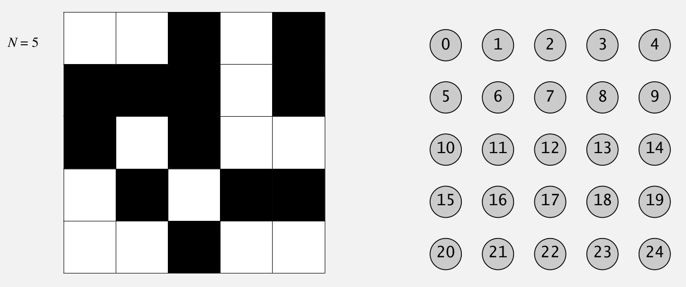
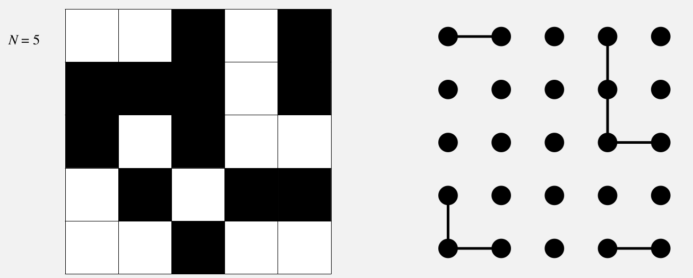
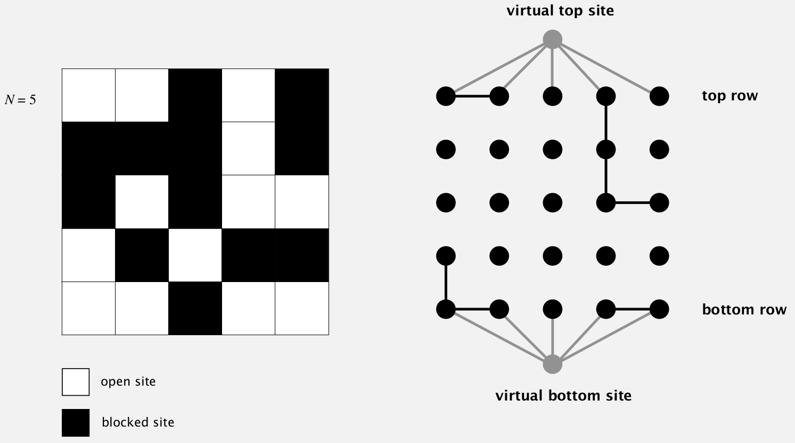

[](https://classroom.github.com/online_ide?assignment_repo_id=4752853&assignment_repo_type=AssignmentRepo)
# Нэгтгэх-Олох бүтэц
 

**Нэвчилт (percolation)** бодлогыг бодно. (N x N) хэмжээтэй тэгш өнцөгт өгөгдсөн. Тэгш өнцөгтийн нүд бүр хаалттай эсвэл нээлттэй гэсэн хоёр төлөвтэй. Дээд талын буюу хамгийн эхний эгнээнээс зөвхөн нээлттэй нүдээр дамжин хамгийн доод талын нүдэнд очиж чадах бол нэвчиж байна гэж үзнэ. Дамжихдаа зөвхөн бөөрөөрөө нийлсэн нүдээр дамжина.

|  |  |
|:---------------------------------------------:|:--------------------------------------------------:|
| Нэвчиж байгаа төлөв                           | Нэвчих боломжгүй төлөв                             |


Зурагт (8 x 8) хэмжээтэй квадратыг авч үзсэн. Хар өнгөтэй нүднүүд нь хаалттай нүдийг, цагаан өнгөтэй нүднүүд нь нээлттэй нүдийг дүрсэлнэ. Эхний зурагт бөөрөөрөө наалдсан цагаан нүдээр дамжин 1-р мөрөөс, 8-р мөр хүрэх боломжтой тул нэвчинэ. Харин дараагийн зурагт нэвчих боломжгүй.

Хамгийн эхлээд бүх нүднүүд хаалттай байна. Дараагаар нь `M` ширхэг нээх үйлдлийг гүйцэтгэнэ. Нээх үйлдэл `x`, `y` хоёр тооноос бүрдэх ба `x`-р мөрний `y`-р баганад байгаа нүдийг нээнэ. Таны даалгавар бол хэд дүгээр үйлдэл дээр систем нэвчих боломжтой болсныг хэвлэнэ. Хэрэв бүх `M` нээх үйлдлийг хийсний дараа систем нэвчихгүй бол `-1`-ийг хэвлэнэ.

**Таны програм N <= 5000 байхад 9 секундийн дотор ажиллах ёстой**

## Оролт
Эхний мөрөнд `N`, `M` тоонууд орч ирнэ. Дараагийн `M` мөр тус бүр нээх үйлдлийн `x`, `y` хоёр тоонуудаас тогтно. Мөр, баганын дугаар 0-ээс эхэлнэ.
Жишээ нь 
```
4 8
3 0
2 1
2 0
0 1
1 1
1 2
3 3
2 3
```
гэж оруулбал дараах хэлбэрийн хүснэгт үүснэ.
```
*o**
*oo*
oo*o
o**o
```

## Гаралт

Систем нэвчих боломжтой болсон хамгийн эхний үйлдлийн дугаарыг хэвлэнэ. Үйлдлүүдийг 1-ээс эхлэн тоолно. Боломжгүй бол `-1`-ыг хэвлэнэ.
Дээрх жишээ оролтын хувьд
```
5
```
5-р үйлдлийг хийсний дараа нэвчиж байгаа тул `5` гэж гаргана. Систем нэгэнд нэвчсэн тул 5-аас хойших үйлдлүүд нөлөөгүй.
**Хариуг хэвлээд шинэ мөр авах ёстой('\n').**

## Хэрэгжүүлэх заавар

### Оройнуудыг дугаарлах

Квадратын оройнуудыг зүүнээс баруун тийш 0-ээс N*N - 1 хүртэл дугаарлана. `N = 5` үеийн зургийг харуулав.

|  |
|:-----------------------------------------------------------:|
| Квадратын нүдийг оройн тоонд буулгах                        |


Энэ нь NxN хэмжээтэй, 0-ээс N*N-1 хүртэлх оройнуудыг агуулах Union-Find бүтэц байгуулна гэсэн үг.

### Нээгдсэн оройнуудыг холбох

Хэрэв зэргэлдээ хөрш нүднүүд нээлттэй бол тэдгээрийг хооронд нь холбоно.
|  |
|:-----------------------------------------------------------:|
| Нээлттэй оройнуудыг хооронд нь холбоно                      |


Нээлттэй нүдэнд харгалзах, Union-Find бүтэц дахь оройнуудыг хооронд нь холбоно.

### Дээд мөр, доод мөртэй холбогдсон эсэхийг шалгах

Нэвчсэн эсэхийг шалгахдаа 1-р мөрийн бүх `N` оройг, сүүлийн мөрийн бүх `N` оройтой хослуулах хослолын тоо `N*N` ширхэг. Тэгвэл `N*N` удаа `connected` функцийг дуудах нь хэтэрхий удна. Тиймээс дараах байдлаар нэмэлт 2 оройг оруулж ирж, уг хоёр орой дээр `connected` функцийг нэг л удаа дуудаж нэвчсэн эсэхийг шалгана.

|  |
|:---------------------------------------------------------------------------------------------:|
| Нэвчилтийг хурдан аргаар шалгахын тулд нэмэлт хийсвэр оройг нэмнэ                             |


## Хэрэгжүүлэх аргачлал

  1. `main.c` дотор өгөгдлийн унших, бодлогыг бодох функцийг дуудна.
  2. `uf.c` дотор Union-Find бүтцийг хэрэгжүүлнэ. Зам агшаах сайжруулалттай хамт хэрэгжүүлбэл илүү хурдан.
  3. Хүссэнээрээ нэмэлт функц тодорхойлох боломжтой.
