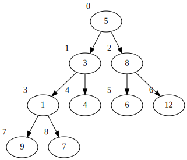

[](https://classroom.github.com/online_ide?assignment_repo_id=4146824&assignment_repo_type=AssignmentRepo)
# Бүтэн Хоёртын Мод (Complete Binary Tree)
 

Бүтэн Хоёртын Мод бүтцийг зааврын дагуу хэрэгжүүл. Уг даалгавар 2b: стак, дараалал, жагсаалттай бүтцийн хувьд адил. 

## Ерөнхий файл
`DS.h` нь бүтцийн ерөнхий толгой файл. Дотор нь Array, CBTree бүтцүүд тодорхойлогдсон ба тэдгээр дээр хийгдэх үйлдлүүдийн функцийн зарлалт байна. Уг файлыг өөрчлөх ёсгүй.

## Даалгаврыг компайл хийх
`make` командыг ашиглан дараах байдлаар кодыг хөрвүүлээд, ажиллуулах боломжтой.
```shell
make
./cbt
```

## Даалгаврыг хийх заавар

Энэ даалгаврыг хийхэд шаардлагатай мэдлэг:
  1. Си хэлний бүтэц (struct).
  2. Хүснэгт.
  3. Си хэлний хаяган хувьсагч, дам хандалтын ойлголт (pointer, dereference).

### Бүтэн Хоёртын мод бүтэц (CBTree)

`CBTree` бүтэц нь дараах байдлаар тодорхойлогдсон, `tree` гэсэн ганц гишүүнтэй.
```C
struct Array {
        int a[100];
        int len;
};

struct CBTree {
        struct Array tree;
};
```

Жишээ нь `CBTree tr;` гэсэн бүтцэн хувьсагч үүсгэснээр доторх гишүүдэд
```C
tr.tree.a[0] = 3;
tr.tree.len = 1;
```
байдлаар хандаж болох ба эсвэл
```C
#define cb_arr tree.a
#define cb_len tree.len
```
макроны тусламжтайгаар 
```C
tr.cb_arr[0] = 3;       // Адилхан: tr.tree.a[0] = 3; 
tr.cb_len = 1;          // Адилхан: tr.tree.len = 1;
```
гэж хандах боломжтой.

### Хэрэгжүүлэх функцүүд

`CBTree` бүтцэн хувьсагч үүсгэснээр Хоёртын Бүтэн Модыг үүсгэх ба дараах функцэд бүтцэн хувьсагчийн хаягийг дамжуулснаар, тухайн модон дээр үйлдлүүдийг хийх боломжтой. Уг даалгаварт дараах функцүүдийг хэрэгжүүлнэ.



  * Оруулах функц: p-ийн зааж буй CBTree-д x утгыг оруулна. Хоёртын бүтэн мод зүүнээс баруунруу өсөх тул хүснэгтийн хамгийн төгсгөлд оруулна.
    ```C
    void cb_push(CBTree *p, int x);
    ```
    
  * Зүүн хүүгийн индексийг буцаах функц: p-ийн зааж буй CBTree-д idx индекстэй оройны зүүн хүүгийн индексийг буцаана. Зүүн хүү байхгүй бол -1 буцаана.
    ```C
    int cb_left(const CBTree *p, int idx);
    ```
    Жишээ нь зураг дээрх модны хувьд `cb_left(&tr, 1)` нь 3-ыг буцаана.

  * Баруун хүүгийн индексийг буцаах функц: p-ийн зааж буй CBTree-д idx индекстэй оройны баруун хүүгийн индексийг буцаана. Баруун хүү байхгүй бол -1 буцаана.
    ```C
    int cb_right(const CBTree *p, int idx);
    ```
    Жишээ нь зураг дээрх модны хувьд `cb_right(&tr, 1)` нь 4-ыг буцаана.

  * Хайх функц: p-ийн зааж буй CBTree-с x тоог хайн, хамгийн эхэнд олдсон индексийг буцаана. Олдохгүй бол -1 утгыг буцаана.
    ```C
    int cb_search(const CBTree *p, int x);
    ```
    Жишээ нь зураг дээрх модны хувьд `cb_search(&tr, 5)` нь 0-ыг буцаана.

  * Өвөг эцгийг хэвлэх функц: p-ийн зааж буй CBTree-д idx индекстэй зангилаанаас дээшхи бүх өвөг эцэгийн утгыг хэвлэх үйлдлийг хийнэ. Тухайн орой өөрөө өвөг эцэгт орохгүй. Өвөг эцэг бүрийг нэг шинэ мөрөнд хэвлэнэ. Өвөг эцэгийг доороос дээшхи дарааллаар хэвлэнэ.
    ```C
    void cb_ancestors(const CBTree *p, int idx);
    ```
    Жишээ нь зураг дээрх модны хувьд `cb_ancestors(&tr, 7);` нь 
    ```shell
    1
    3
    5
    ```
    гэж хэвлэнэ.
    
  * Өндрийг буцаах функц: p-ийн зааж буй CBTree-ийн өндрийг буцаана.
    ```C
    int cb_height(const CBTree *p);
    ```
    Жишээ нь зураг дээрх модны хувьд `cb_height(&tr);` нь 4 гэж буцаана.
    
  * Ах, дүүгийн индексийг буцаах функ: p-ийн зааж буй CBTree-д idx оройны ах, дүү оройн дугаарыг буцаана. Тухайн оройн эцэгтэй адил эцэгтэй орой. Ах, дүү нь байхгүй бол -1-г буцаана.
    ```C
    int cb_sibling(const CBTree *p, int idx);
    ```
    Жишээ нь зураг дээрх модны хувьд `cb_sibling(&tr, 4);` нь 3 гэж буцаана.
    
  * Pre-order: p-ийн зааж буй CBTree-г idx дугаартай зангилаанаас эхлэн preorder-оор хэвлэ. Орой бүрийг нэг шинэ мөрөнд хэвлэнэ.
    ```C
    void cb_preorder(const CBTree *p, int idx);
    ```
    Жишээ нь зураг дээрх модны хувьд `cb_preorder(&tr, 1);` гэж дуудвал
    ```shell
    3
    1
    9
    7
    4
    ```
    гэж хэвлэнэ.

  * In-order: p-ийн зааж буй CBTree-г idx дугаартай зангилаанаас эхлэн in-order-оор хэвлэ. Орой бүрийг нэг шинэ мөрөнд хэвлэнэ.
    ```C
    void cb_inorder(const CBTree *p, int idx);
    ```
    Жишээ нь зураг дээрх модны хувьд `cb_inorder(&tr, 1);` гэж дуудвал
    ```shell
    9
    1
    7
    3
    4
    ```
    гэж хэвлэнэ.
    
  * Post-order: p-ийн зааж буй CBTree-г idx дугаартай зангилаанаас эхлэн post-order-оор хэвлэ. Орой бүрийг нэг шинэ мөрөнд хэвлэнэ.
    ```C
    void cb_postorder(const CBTree *p, int idx);
    ```
    Жишээ нь зураг дээрх модны хувьд `cb_postorder(&tr, 1);` гэж дуудвал
    ```shell
    9
    7
    1
    4
    3
    ```
    гэж хэвлэнэ.

  * Навчийг хэвлэх функц: p-ийн зааж буй CBTree-с idx дугаартай зангилаанаас доошхи бүх навчийг олно. Тухайн орой өөрөө навч байж болно. Навч тус бүрийн утгыг шинэ мөрөнд хэвлэнэ. Навчыг зүүнээс баруун тийш олдох дарааллаар хэвлэнэ.
    ```C
    void cb_leaves(const CBTree *p, int idx);
    ```
    Жишээ нь зураг дээрх модны хувьд `cb_leaves(&tr, 1);` гэж дуудвал
    ```shell
    9
    7
    4
    ```
    гэж хэвлэнэ.
    
  * Ур, удам хэвлэх функц: p-ийн зааж буй CBTree-д idx индекстэй оройноос доошхи бүх үр садыг хэвлэнэ. Тухайн орой өөрөө үр сад болохгүй. Үр, сад бүрийг нэг шинэ мөрөнд хэвлэнэ. Үр садыг pre-order дарааллаар хэлэх ёстой.
    ```C
    void cb_descendants(const CBTree *p, int idx);
    ```
    Жишээ нь зураг дээрх модны хувьд `cb_descendants(&tr, 1);` гэж дуудвал
    ```shell
    1
    9
    7
    4
    ```
    гэж хэвлэнэ.
    
  * Хэмжээг буцаах функц: p-ийн зааж буй Tree-д хэдэн элемент байгааг буцаана.
    ```C
    int cb_size(const CBTree *p)
    ```
    Жишээ нь зураг дээрх модны хувьд `cb_size(&tr);` нь 9-г буцаана.
  
  * Түвшинг буцаах функц: p-ийн зааж буй CBTree-д x утгаас, үндэс хүртэлх оройнуудын тоог буцаана. x тоо олдохгүй бол -1-г буцаана.
    ```C
    int cb_level(const CBTree *p, int x);
    ```
    Жишээ нь зураг дээрх модны хувьд `cb_level(&tr, 1);` нь 2-г буцаана. Төвшинг 0-с эхлэн тоолсон.


