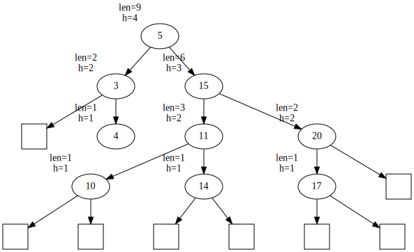

[](https://classroom.github.com/online_ide?assignment_repo_id=4481096&assignment_repo_type=AssignmentRepo)
# AVL Мод буюу тэнцвэрт мод
 

Хаяган хувьсагч ашиглан AVL тэнцвэрт модыг (ТМ) хэрэгжүүлнэ. Хайлтын модонд дандаа **ЯЛГААТАЙ** утгууд оруулна гэж үзэж болно.

Уг мод хоёртын хайлтын модны оруулах, устгах, хайх үйлдлүүд хамгийн муу тохиолдолд O(n) байх муу тохиолдлыг шийдсэн. Таны хэрэгжүүлэлт n = 100,000 буюу 100,000 ширхэг тоо оруулж, устгахад **2 секундад** амжих хийх ёстой.

**Даалгаврын хийхэд `NULL` хаягт хандвал үргэлж `segmentation fault` авахыг анхаарна уу!**

## Ерөнхий файл
`DS.h` нь бүтцийн ерөнхий толгой файл. Уг файл дотор хэрэгжүүлэх функцүүд зарлагдсан байна.

## Даалгаврыг хийх заавар

Энэ даалгаврыг хийхэд шаардлагатай мэдлэг:
  1. Си хэлний бүтэц (struct)
  2. Си хэлний хаяган хувьсагч, дам хандалтын ойлголт (pointer, dereference)
  3. Динамикаар санах ой хуваарилах `malloc` функц, чөлөөлөх `free` функц
  
Модны орой бүр дараах мэдээллийг агуулна.

| Elm    |
|:------:|
| x      |
| height |
| len    |
| *L     |
| *R     |
|        |

  * `x`: Тухайн оройд хадгалагдах утгыг хадгална.
  * `height`: Тухайн орой дээр үндэстэй дэд модны өдрийг хадгална. Дэд мод гэдэг нь өөрийг нь оролцуулан, өөрийн бүх үр удмыг багтаасан ТМ байна.
  * `len`: Тухайн орой дээр үндэстэй дэд модонд хэдэн элемент байгааг хадгална. 
  * `*L`: Зүүн хүүхдийн хаягийг заах хаяган хувьсагч. Өөрөөр хэлбэл зүүн дэд модны хаяг гэж ойлгож бас болно.
  * `*R`: Баруун хүүхдийн хаягийг заах хаяган хувьсагч. Өөрөөр хэлбэл баруун дэд модны хаяг гэж ойлгож бас болно.

Модны орой бүрийн хадгалах, эдгээр мэдээллийг 
```C
struct Elm {
        int x;
        int height;
        int len;
        struct Elm *L;
        struct Elm *R;
};
typedef struct Elm Elm;
```
бүтцэд хадгална. Тухайн оройн зүүн баруун, хүүхэдгүй бол L, R хаяган хувьсагчууд нь `NULL` хаягийг хадгалах ёстой. Харин `height = 1`, `len = 1` байна.



Дээрх зурагт үзүүлсэн ТМны оройнуудын мэдээллийг зүүн дээд хэсэгт нь харуулсан. Дөрвөлжин дүрсээр хоосон оройг харуулав.

Тэнцвэрт Модыг хадгалахад модны үндэс оройг заах ганц хаяган хувьсагч хэрэгтэй. Үүнийг 
```C
struct AVL {
        Elm *root;
};
```
бүтцэд хадгалах болно. Хэрэгжүүлэх функцүүд нь `AVL` бүтцийн хаягийг хүлээн авах ба дотор нь модны үндэс хадгалагдсан тул модны бүх элементийг үндсээс нь хөөн хандах боломжтой.

### Функцүүдийг хэрэгжүүлэх заавар
Функцүүдийг хэрэгжүүлэхдээ модны үндсийг хадгалах `AVL` бүтцэн хувьсагчийн хаягийг хүлээн авах ба түүний модны үндсийг хадгалах `root` хувьсагчаас хөөн бусад гишүүдэд хандана.

Өөрийн хэрэглэх функцүүдийг хүссэнээрээ зарлан ашиглах боломжтой. Жишээ нь оруулах үйлдлийг лекц дээр үзсэнээр дараах байдлаар хэрэгжүүлэх боломжтой.
```C
void avl_put(AVL *ptree, int x)
{
    ptree->root = insert1(ptree->root, x);
    // эсвэл
    insert2(ptree->root, x, NULL);
}
```

### Хэрэгжүүлэх функцүүд

  * Оруулах функц: ТМнд `x` утгыг оруулна. Оруулахдаа ТМны зарчмаар оруулах бөгөөд оруулсан байрлалаас дээшхи өвөг эцгийн `len`, `height` утгууд өөрчлөгдөнө. Мод хоосон байсан бол `ptree->root` хаяг өөрчлөгдөж шинээр орсон оройг заана. Хэрэв мод тэнцвэрээ алдсан бол тохирох тэнцвэржүүлэх үйлдлүүдийг хийнэ.
    ```C
    void avl_put(AVL *ptree, int x);
    ```

  * Хайх функц: ТМноос `x` утгыг хайн олдсон оройн `Elm*` хаягийг буцаана. Олдохгүй бол `NULL` хаягийг буцаана. Мод дандаа ялгаатай элементүүд хадгална гэж үзэж болно. ТМнд ямарч өөрчлөлт орохгүй.
    ```C
    Elm *avl_get(const AVL *ptree, int x);
    ```
    
  * Устгах функц: ТМноос `x` утгыг хайж олоод устгана. Олдохгүй бол юу ч хийхгүй. Устсан оройн нөлөөлөх оройнуудын `len`, `height` утгуудыг шинэчилнэ. Хэрэв мод тэнцвэрээ алдсан бол тохирох тэнцвэржүүлэх үйлдлүүдийг хийнэ.
    ```C
    void avl_del(AVL *ptree, int x);
    ```
    
  * Хамгийн багыг устгах функц: ТМноос хамгийг бага утгыг нь устгах функц. Устгасан утгыг буцаана. Мод хоосон эсэхийг шалгах шаардлагагүй. Устсан оройн нөлөөлөх оройнуудын `len`, `height` утгуудыг шинэчилнэ. Хэрэв мод тэнцвэрээ алдсан бол тохирох тэнцвэржүүлэх үйлдлүүдийг хийнэ.
    ```C
    int avl_delMin(AVL *ptree);
    ```
    Жишээ нь дээрх ТМын хувьд `3` утгыг устгаад, буцаана.

  * Хэвлэх функц: ТМыг inorder дарааллаар, нэг оройн мэдээллийг нэг мөрөнд хэвлэнэ. Оройн мэдээллийг хэвлэхдээ `x`, `len`, `height` гэсэн дарааллаар хэвлэнэ.
    ```C
    void avl_inorder(const AVL *ptree);
    ```
    Жишээ нь дээрх ТМыг хэвлэхэд дараах байдалтай хэвлэгдэнэ.
    ```
    3 2 2
    4 1 1
    5 9 4
    10 1 1
    11 3 2
    14 1 1
    15 6 3
    17 1 1
    20 2 2
    ```
  * Хэмжээг буцаах функц: ТМноос `x` утгатай оройг хайж олоод, тухайн оройд суурилсан дэд модонд хэдэн орой байгааг олж буцаана. Олдохгүй бол -1-ийг буцаана.
    ```C
    int avl_size(const AVL *ptree, int x);
    ```
    Жишээ нь дээрх ТМны хувьд `x = 20` бол `size` нь `5`-ыг буцаана.
    
  * Өндрийг буцаах: ТМноос `x` утгатай оройг хайж олоод, тухайн оройд суурилсан дэд модны өндөр хэд байгааг олж буцаана. Олдохгүй бол -1-ийг буцаана.
    ```C
    int avl_height(const AVL *ptree, int x);
    ```
    Жишээ нь дээрх ТМны хувьд `x = 15` бол `height` нь `3`-г буцаана.
